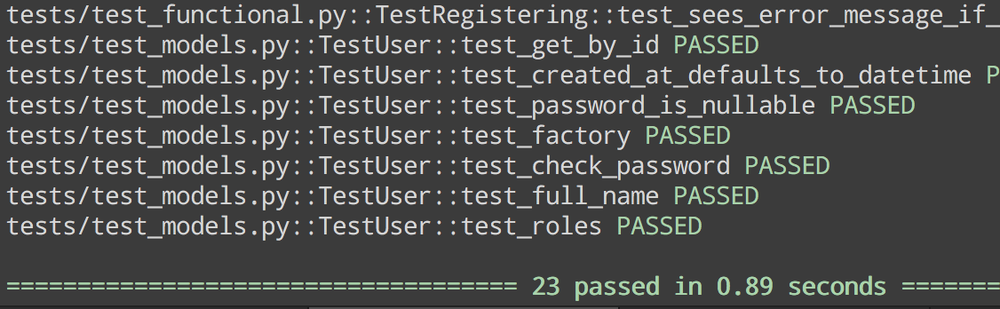
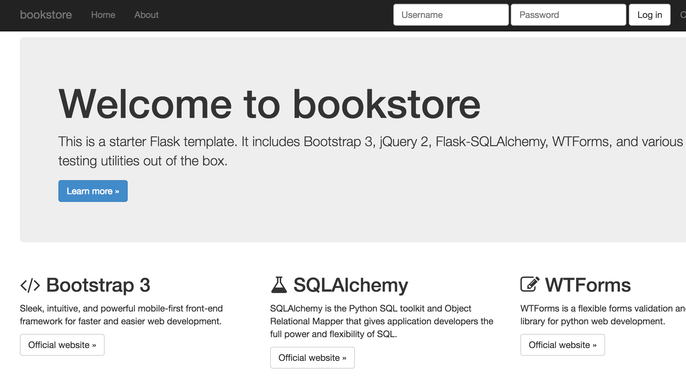

===============================
bookstore
===============================

An online book store for our Database module.
Project is based off this cookiecutter skeleton_.
.. _skeleton: https://github.com/sloria/cookiecutter-flask

Setup
----------

If you are using pip3:
First, you need to install virtualenv_. This ensures that you only have the necessary
packages for this project. You don't want to pollute the global python "namespace"
with many libraries you might not need.

.. _virtualenv: https://virtualenv.pypa.io/en/stable/installation/

If you are using conda:
You shouldn't need to do anything here. You just need to know how to create a virtual
environment in conda for python.

Creation, activation and deactivation.

.. code-block :: bash

    conda create -n bookstore python
    source activate bookstore
    source deactivate

You will see something like this in terminal:

.. code-block :: bash

    (bookstore) robin-lee: <cursor>

Further instructions will be for conda.

Quickstart
----------

First, set your app's secret key as an environment variable. For example,
add the following to ``.bashrc`` or ``.bash_profile``.

.. code-block :: bash

    export STORE_SECRET='something-really-secret'

Before running shell commands, set the ``FLASK_APP`` and ``FLASK_DEBUG``
environment variables

.. code-block :: bash

    export FLASK_APP=/path/to/autoapp.py
    export FLASK_DEBUG=1

Then run the following commands to bootstrap your environment and ensure
that `flask test` runs smoothly. Check that `pip --version` references the anaconda
path for python `pip 8.1.2 from /Users/robin/anaconda/envs/bookstore/lib/python3.5/site-packages (python 3.5)`::

    git clone https://github.com/robin-lee/store
    cd store
    conda create -n bookstore python
    source activate bookstore
    pip install -r requirements/dev.txt
    bower install
    flask test
    flask run

You will see this for successful tests.

For a successful run, you will see a pretty welcome screen. Explore the various files and try to make sense of it.

Once you have installed your DBMS, run the following to create your app's
database tables and perform the initial migration ::

    flask db init
    flask db migrate
    flask db upgrade
    flask run

Deployment
----------

In your production environment, make sure the ``FLASK_DEBUG`` environment
variable is unset or is set to ``0``, so that ``ProdConfig`` is used.

Shell
-----

To open the interactive shell, run ::

    flask shell

By default, you will have access to the flask ``app``.

Running Tests
-------------

To run all tests, run ::

    flask test

Migrations
----------

Whenever a database migration needs to be made. Run the following commands ::

    flask db migrate

This will generate a new migration script. Then run ::

    flask db upgrade

To apply the migration.

For a full migration command reference, run ``flask db --help``.
